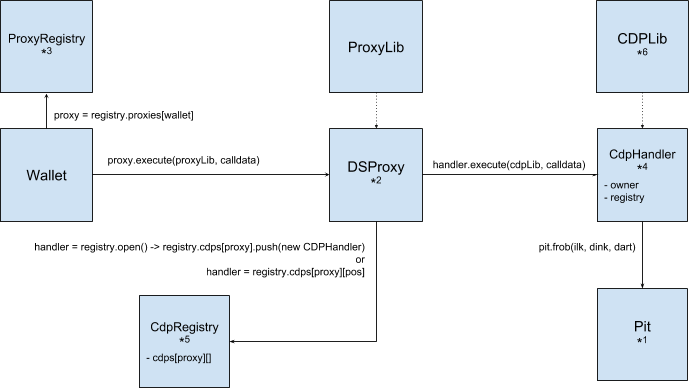

# mcd-cdp-handler

A set of smart contracts that inherit from DSProxy and is tailored at wrapping CDPs and allowing transferring ownership.

## Why

* MCD contracts do not allow transferring ownership of a CDP. The CDP is indexed
to the owner address, so the use of a proxy is necessary.

* Grouping transactions: the process of depositing a collateral and generating DAI requires different steps. Grouping them in 1 or 2 txs improves user experience

## Design



## Usage

```
# deploy registry
dapp create CdpRegistry
# tell registry to create handler
seth send <CdpRegistryAddress> "create()(address)"
# transfer ownership of a CDP
